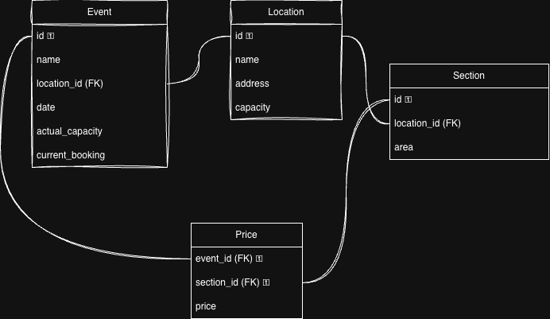
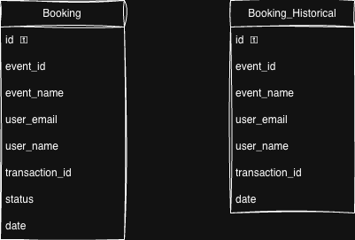
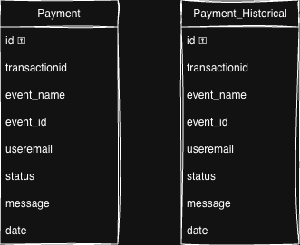
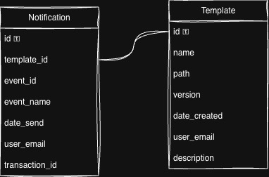

# Data Model

## Event

### Database model

**Table:** Location  
**Description:** Available places for the events  
**Fields:**  
 - id -> integer
 - name -> varchar
 - address -> varchar
 - capacity -> integer

 **Table:** Event  
 **Description:** Information about the function  
**Fields:**
 - id -> integer
 - name -> varchar
 - location_id -> integer
 - date -> timestamp
 - actual_capacity -> integer  (should be lower or equal to location.capacity)
 - current_booking -> integer (total of sold tickets)

**Table:** Section  
**Description:** How each facility is divided  
**Fields:**
 - id
 - location_id
 - area  

**Table:** Price  
**Description:** Store information about the price for each event depending on the section  
**Fields:**
 - event_id -> integer
 - section_id -> integer
 - price -> number  

 _*Composite primary key with evetn_id and section_id_

## Booking

### Database model

**Table:** Booking  
**Description:** Save information about bookings  
**Fields:**
 - id -> integer
 - event_id -> integer
 - event_name -> varchar
 - user_id -> varchar
 - user_name -> varchar
 - transaction_id -> number
 - status -> varchar  
 - date -> timestamp

**Table:** Booking_Historical  
**Description:** Save information about bookings  
**Fields:**
 - id -> integer
 - event_id -> integer
 - event_name -> varchar
 - user_id -> varchar
 - user_name -> varchar
 - transaction_id -> number
 - status -> varchar  
 - date -> timestamp

## Payment

**Table:** Payment  
**Description:** Save information regarding payment  
**Fields:**
 - id -> integer
 - transaction_id -> number
 - event_name -> varchar
 - event_id -> integer
 - user_email -> varchar
 - user_name -> varchar
 - status -> varchar  
 - message -> varchar
 - date -> timestamp

**Table:** Payment_Historical  
**Description:** Save historical information regarding payment  
**Fields:**
 - id -> integer
 - transaction_id -> number
 - event_name -> varchar
 - event_id -> integer
 - user_email -> varchar
 - user_name -> varchar
 - status -> varchar  
 - message -> varchar
 - date -> timestamp 

## Notification

**Table:** Notification  
**Description:** Track information about emails sent to the customers  
**Fields:**
 - id -> integer
 - template_id -> integer
 - event_id -> integer
 - event_name -> varchar
 - date_send -> timestamp 
 - user_email -> varchar
 - transaction_id -> number

**Table:** Template  
**Description:** Store information about avilable templates, located in S3, templates will be send to notify the customer about the result of his payment 
**Fields:**
 - id -> integer
 - template_id -> integer
 - event_id -> integer
 - event_name -> varchar
 - date_send -> timestamp 
 - user_email -> varchar
 - transaction_id -> number