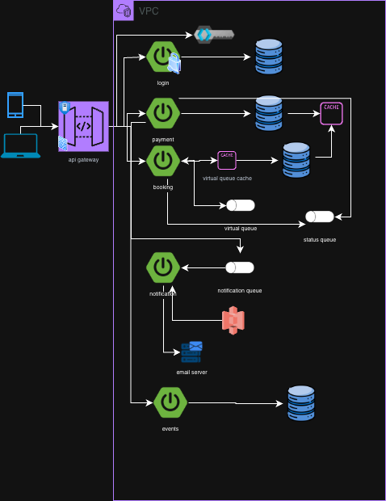

# Diagrama de arquitectura

### STACK

**FRONT END:** Anglar 21  
**BACK END:** 
- Java 25
- Spring Boot 4.0.6
- Spring Security 7.0
- Spring JPA 4.0.5

**CACHE:** Redis v8.2  
**DATABASE:** Postgres 18  
**MQS:** Kafka 4.3.0  
**CLOUD:** AWS

Microservices will be mounted in Kubernetes ccluster to handle resilience.

