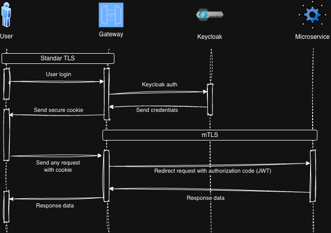
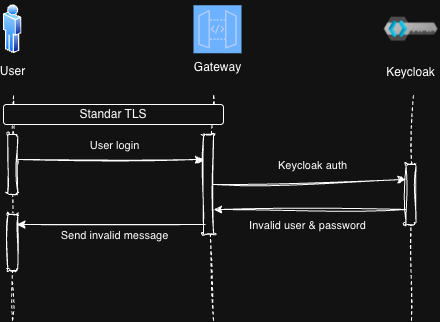
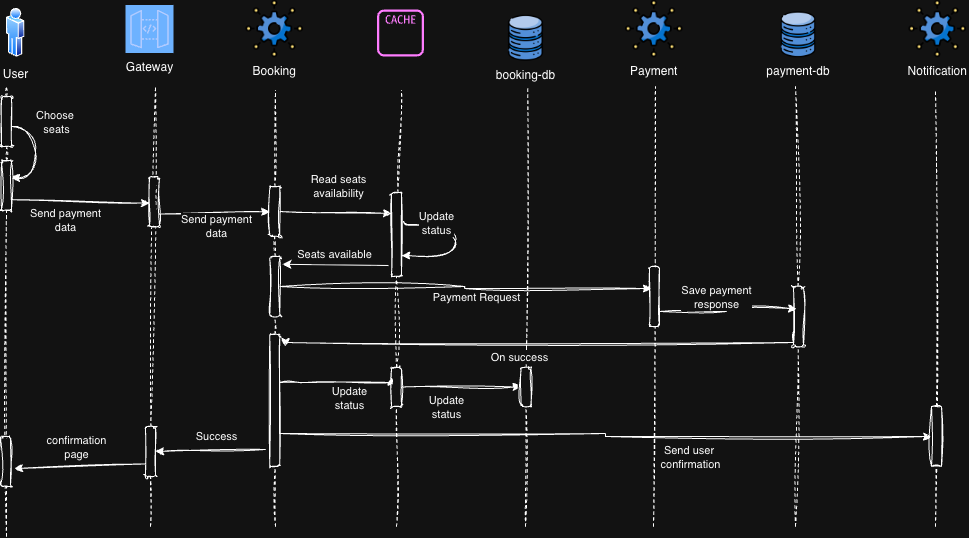

# Sequence diagrams

## Login

When a user access to the system, it need to authenticate, so the system can identify and authorize user access.

There are two scenarios identified.
1. The user enter his data (user and password), the user is found and have access to the system.
1. The user enter invalid data, either because the user doesn't exisit nor the user and password don't match, then te user can't login into the system.

### On success

1. The user type his user and password.
1. The gateway receives the data and send to keycloak.
1. Keycloak validates and found the user, it returns a hashcoded token, which will work as credential.
1. The gateway send the cookie to the UI.
1. The UI stores the code in a secure cookie (_HttpOnly_).
1. For any other request, the UI will attach the cookie to the gateway.
1. Gateway will keep the token between request in order to continue the authorization process.

_Note: The TLS and mTLS are configured at infrastructure layer_

### On fail

1. The user type his user and password.
1. The gateway receives the data and send to keycloak.
1. Keycloak validates but don't found date (either user doesn't exists or user and password didn't match).
1. The gateway send message to the UI _Invalid User or Password_ or _User not found_ depending on the scenario.
1. UI show message to the user.

## Booking

Assuming that:
 - The user is already logged (authenticated and authorized).
 - The user has already searched the event.
 - The user is already at the seat selection screen.

### On success

1. The user chooses his seats and add his payment data.
1. Send payment information via gateway.
1. UI will open a socket to wait for booking result.
1. Booking microservice, vaildates (in cache) if the seats still available (status `AVAILABLE`), if so the seats status will be updated in cache to `AWAITING`, blocking the seats for other requests.
1. Create a Booking record in database with status `IN_PROGRESS`.
1. Booking service sends payment request.
1. Payment service registers the payment, and wait till lthe vendor send payment confirmation with satus `IN_PROGRESSS`.
1. When payment is success the record is updated to `SUCCESS`, and send response to Booking service.
1. Update booking record status to `BOOKED`.
1. Booking will update the status of the seats in cache then in database to `UNAVAILABLE`.
1. Booking send the request to Notificcation service, requesting for a user email confirmation.
1. Booking service send notification to UI, so the user can see the confirmation.

### On fail

#### Booking fail

1. The user chooses his seats and add his payment data.
1. Send payment information via gateway.
1. UI will open a socket to wait for booking result.
1. Booking microservice, vaildates(in cache) if the seats still available (status `AVAILABLE`), for this scenario the seats are not available.
1. Create a booking reccord in booking databases with status `FAILED`.
1. Booking service will send the failed meesage to UI socket.

#### Payment fail

1. The user chooses his seats and add his payment data.
1. Send payment information via gateway.
1. UI will open a socket to wait for booking result.
1. Booking microservice, vaildates (in cache) if the seats still available (status `AVAILABLE`), if so the seats status will be updated in cache to `AWAITING`, blocking the seats for other requests.
1. Create a Booking record in database with status `IN_PROGRESS`.
1. Booking service sends payment request.
1. Payment service registers the payment, and wait till lthe vendor send payment confirmation with satus `IN_PROGRESSS`, for this scenario the payment is unsuccesss.
1. As payment is unsuccess the record is updated to `FAILES`, and send response to Booking service.
1. Update booking record status to `FAILED`.
1. Booking will update the status of the seats in cache then in database to `AVAILABLE`.
1. Booking send the request to Notificcation service, requesting for a user email notification, sending evidence that the payment failed and no charge was don.
1. Booking service send notification to UI, so the user can see the result of the payment.